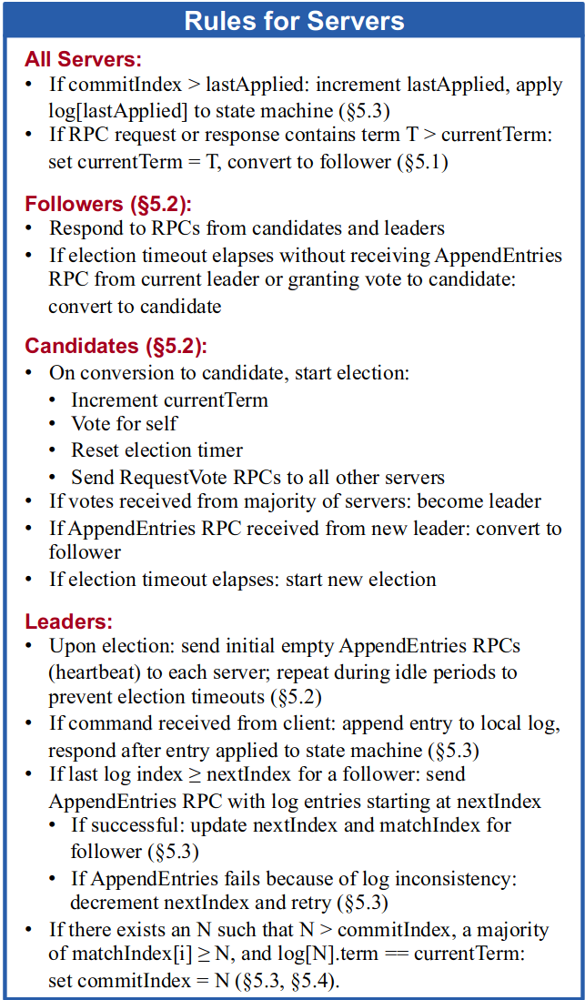

# Lab3 Raft

# Part 3A: leader election

实验地址

> [https://pdos.csail.mit.edu/6.824/labs/lab-raft.html](https://pdos.csail.mit.edu/6.824/labs/lab-raft.html "https://pdos.csail.mit.edu/6.824/labs/lab-raft.html")

论文地址

> [https://pdos.csail.mit.edu/6.824/papers/raft-extended.pdf](https://pdos.csail.mit.edu/6.824/papers/raft-extended.pdf "https://pdos.csail.mit.edu/6.824/papers/raft-extended.pdf")

3A主要实现了leader的选举。论文中给出了相关数据结构和处理逻辑，详细内容请参考原论文。

***

完整项目讲解

> [https://blog.csdn.net/joker15517/category\_12753637.html](https://blog.csdn.net/joker15517/category_12753637.html "https://blog.csdn.net/joker15517/category_12753637.html")

MIT6.5840 课程Lab完整项目地址

> [https://github.com/Joker0x00/MIT-6.5840-Lab/](https://github.com/Joker0x00/MIT-6.5840-Lab/ "https://github.com/Joker0x00/MIT-6.5840-Lab/")

***

## 大致框架

这一部分实验主要参考了论文中的figure2以及5.1部分。




Raft集群需要选举一个server作为leader来处理客户端请求，并复制log到其他server上。

当server启动时，身份都为Follower。每个server都有一个选举计时器，当计时器到期时，会触发该server进行Leader选举。为防止多个server同时开启选举，导致split vote情况（无法选出leader），超时时间在一个区间内随机选择。当某个server开启选举后，它的身份转变为Candidate，首先增加任期号，投自己一票。之后它会并行向其他server发送vote request（调用rpc）请求投票。如果该server获得了超过半数的票（raft集群通常是一个奇数，剩余server半数即可），该server便赢得了选举。然后该server身份转变为Leader，Leader会定期发送AppendEntries RPC，来阻止其余server选举，即重置选举计时器。

以上便是粗略的流程，实现起来仍需要注意很多细节，特别是在上方图中给出的server应该遵循的规则。下面根据代码详细阐述某些细节。

## 详细过程

### 数据结构

根据上方图中的内容，实现以下数据结构，这里只保留了3A用到的数据。

1. RequestVoteArgs-用于RequestVote RPC调用

```go
type RequestVoteArgs struct {
  Term         int // candidate's term
  CandidateId  int // candidate's id
}
```

1. RequestVoteReply

```go
type RequestVoteReply struct {
  Term        int  // 用来更新candidate的term
  VoteGranted bool // 其他follower是否投票
}
```

1. AppendEntriesArgs -于AppendEntries RPC调用

```go
type AppendEntriesArgs struct {
  Term         int // 任期
  LeaderId     int // leader id
}
```

1. AppendEntriesReply

```go
type AppendEntriesReply struct {
  Term    int // currentTerm, for leader to update itself
  Success bool // 成功与否
}
```

1. ApplyMsg-3A并未用到，顺便抄下来

```go
type ApplyMsg struct {
  CommandValid bool
  Command      interface{}
  CommandIndex int
  // For 3D:
  SnapshotValid bool
  Snapshot      []byte
  SnapshotTerm  int
  SnapshotIndex int
}
```

1. Raft

```go
type Raft struct {
  mu         sync.Mutex          // Lock to protect shared access to this peer's state
  peers      []*labrpc.ClientEnd // RPC end points of all peers
  persister  *Persister          // Object to hold this peer's persisted state
  me         int                 // this peer's index into peers[]
  dead       int32               // set by Kill()
  
  aeInterval         int // 心跳rpc发送间隔
  currentTerm        int // 当前term
  votedFor           int // 投票给了谁
  log                []Entry // 命令日志
  role               int // 角色：Leader, Candidate, Follower
  tot                int // raft集群服务器总数
  stopElect          bool // 停止选举标志
  stopLeader         bool // 停止leader的行为
  aeCnt              int // 发送一轮ae rpc后，成功响应的服务器数目
  resetElectTimer    chan bool // 重置选举计时器
  stopProcessRoutine chan bool // 停止处理线程，包括选举处理，ae rpc响应处理
}
```

### 初始化

```go
func Make(peers []*labrpc.ClientEnd, me int,
  persister *Persister, applyCh chan ApplyMsg) *Raft {
  rf := &Raft{}
  rf.peers = peers
  rf.persister = persister
  rf.me = me
  rf.mu = sync.Mutex{}

  rf.tot = len(peers)
  rf.currentTerm = 0
  rf.votedFor = -1
  rf.log = make([]Entry, 0)
  rf.stopElect = true
  rf.role = FOLLOWER
  rf.aeCnt = 0
  rf.aeInterval = 100 // 测试要求1s内发送ae rpc不超过10次，因此最好大于100ms
  rf.resetElectTimer = make(chan bool, 1)
  rf.stopProcessRoutine = make(chan bool, 2)
  // initialize from state persisted before a crash
  rf.readPersist(persister.ReadRaftState())

  // start ticker goroutine to start elections
  go rf.ticker()

  return rf
}
```

### 选举计时器

该计时器在make内以后台线程的方式运行，通过rf.resetElectTimer来重置。

```go
func (rf *Raft) ticker() {
  for !rf.killed() {
    ms := 400 + (rand.Int63() % 200)
    Printf("s%v reset timer: %v", rf.me, ms)
    select {
    case <-time.After(time.Duration(ms) * time.Millisecond): // 计时器超时，开启选举
      rf.mu.Lock()
      if rf.role != LEADER {
        if rf.role == CANDIDATE {
          // 如果上一轮选举没有结果，那就结束选举进程
          rf.stopElect = true
        }
        // 开启新的一轮选举
        go rf.elect()
      }
      rf.mu.Unlock()
    case <-rf.resetElectTimer: // 向该通道写入数据重置计时器

    }
  }
  rf.mu.Lock()
  rf.stopElect = true
  rf.stopLeader = true
  rf.mu.Unlock()
}
```

### 选举过程

包含两大部分，分别是发送选举rpc线程和处理rpc响应线程。

1. rpc处理

```go
func (rf *Raft) elect() {
  rf.mu.Lock()
  rf.currentTerm++ // 增加任期号
  rf.role = CANDIDATE // 转为candidate
  rf.votedFor = rf.me // 投自己一票
  rf.stopElect = false // 关闭终止选举标志
  rf.mu.Unlock()
  Printf("s%v start elect: T%v", rf.me, rf.currentTerm)
  voteResult := make(chan *RequestVoteReply, rf.tot)
  // 同时向其他server发送request vote
  for i := 0; i < rf.tot; i++ {
    args := RequestVoteArgs{ // 构造参数
      Term:         rf.currentTerm,
      CandidateId:  rf.me,
      LastLogIndex: 0,
      LastLogTerm:  0,
    }
    if i == rf.me { // 不给自己发
      continue
    }
    go rf.sendRequestVote(i, &args, voteResult) // 并发发送
  }
  voteNum := 1
  for { // 处理rpc响应
    rf.mu.Lock()
    flag := rf.stopElect
    rf.mu.Unlock()
    if flag {
      // close(voteResult)
      return
    }
    select {
    case res := <-voteResult: // 所有的响应均通过该通道传送
      if res.VoteGranted {
        // server vote
        voteNum++
        Printf("s%v vote num: %v", rf.me, voteNum)
        if voteNum > rf.tot/2 {
          // 收到一半以上投票
          // 转为Leader
          Printf("s%v vote half num: %v", rf.me, voteNum)
          go rf.leader()
          return
        }
      } else {
        if res.Term > rf.currentTerm { // 收到的term更新，立即转变为follower
          rf.mu.Lock()
          rf.role = FOLLOWER
          rf.currentTerm = res.Term
          rf.votedFor = -1
          rf.stopElect = true
          rf.stopProcessRoutine <- true
          rf.mu.Unlock()
        }
      }
    case <-rf.stopProcessRoutine:
      return
    }
  }
}
```

1. 发送rpc

```go
func (rf *Raft) sendRequestVote(server int, args *RequestVoteArgs, voteResult chan *RequestVoteReply) {
  reply := RequestVoteReply{}
  for {
    rf.mu.Lock()
    flag := rf.stopElect
    rf.mu.Unlock()
    if flag {
      return
    }

    Printf("s%v send vote request to s%v: T%v", rf.me, server, args.Term)
    // 调用rpc
    ok := rf.peers[server].Call("Raft.RequestVote", args, &reply)
    if ok {
      voteResult <- &reply
      Printf("s%v recieve vote response from s%v", rf.me, server)
      return
    } else {
      // 如因网络问题发送失败，则间隔50ms重新发送
      time.Sleep(time.Duration(50) * time.Millisecond)
    }
  }
}
```

### 心跳机制 Leader

和选举大致一样，分为定期发送AE RPC和处理RPC响应两大部分。

1. 总体框架

```go
func (rf *Raft) leader() {
  // run leader
  rf.mu.Lock()
  rf.role = LEADER
  rf.stopLeader = false
  rf.mu.Unlock()
  Printf("s%v start leader: T%v", rf.me, rf.currentTerm)
  apResult := make(chan *AppendEntriesReply, rf.tot)
  // process AE
  go rf.processAE(apResult)
  // send AE
  go rf.sendAE(apResult)
}
```

1. 发送AE

```go
func (rf *Raft) sendAppendEntries(server int, args *AppendEntriesArgs, apResult chan *AppendEntriesReply) {
  reply := AppendEntriesReply{}
  for {
    rf.mu.Lock()
    flag := rf.stopLeader
    rf.mu.Unlock()
    if flag {
      return
    }
    ok := rf.peers[server].Call("Raft.AppendEntries", args, &reply)
    if ok {
      rf.mu.Lock()
      Printf("s%v recieve ae response from s%v: T%v, T%v", rf.me, server, rf.currentTerm, reply.Term)
      rf.mu.Unlock()
      apResult <- &reply // 通过该通道收集结果
      return
    } else {
      // 重传
      time.Sleep(time.Duration(50) * time.Millisecond)
    }
  }
}
func (rf *Raft) sendAE(apResult chan *AppendEntriesReply) {
  rf.mu.Lock()
  currentTerm := rf.currentTerm
  rf.mu.Unlock()
  for {
    rf.mu.Lock()
    flag := rf.stopLeader
    rf.aeCnt = 1
    rf.mu.Unlock()
    if flag {
      return
    }
    for i := 0; i < rf.tot; i++ {
      if i == rf.me {
        continue
      }
      // 发送AP
      args := AppendEntriesArgs{
        Term:     currentTerm, // 在一个任期内，不要改变AE中的参数term
        LeaderId: rf.me,
      }
      Printf("s%v send ae to s%d: T%v", rf.me, i, args.Term)
      go rf.sendAppendEntries(i, &args, apResult) // 并行发送请求
    }
    // 间隔一定时间发送一轮AE
    time.Sleep(time.Duration(rf.aeInterval) * time.Millisecond) // 后续通过通道控制更灵活，这里就采用了简单的sleep
  }
}
```

1. 处理AE

```go
func (rf *Raft) processAE(apResult chan *AppendEntriesReply) {
  for {
    rf.mu.Lock()
    flag := rf.stopLeader
    rf.mu.Unlock()
    if flag {
      return
    }
    select {
    case res := <-apResult: // 通过该通道处理结果
      rf.mu.Lock()
      if res.Term > rf.currentTerm {
        // 转变为follower
        rf.currentTerm = res.Term
        rf.role = FOLLOWER
        rf.stopLeader = true // 终止发送AE
        rf.votedFor = -1
        rf.mu.Unlock()
        break
      }
      rf.aeCnt++
      if rf.aeCnt > rf.tot/2 {
        // recieve response
        Printf("s%v recieve ae response half: %d", rf.me, rf.aeCnt)
      }
      rf.mu.Unlock()
    case <-rf.stopProcessRoutine: // 终止处理线程
      return
    }
  }
}
```

### RPC

这些函数都是接收RPC的服务器需要执行的。

1. AppendEntries RPC

```go
// heart beat rpc
func (rf *Raft) AppendEntries(args *AppendEntriesArgs, reply *AppendEntriesReply) {
  rf.mu.Lock()
  Printf("s%v recieve ae from s%v: T%v, T%v", rf.me, args.LeaderId, rf.currentTerm, args.Term)
  // 分角色处理，在3B中进行了融合，更完善
  if rf.role == LEADER {
    if args.Term > rf.currentTerm {
      rf.role = FOLLOWER
      rf.votedFor = args.LeaderId
      rf.currentTerm = args.Term
      rf.stopLeader = true
      rf.resetElectTimer <- true
    } else {
      reply.Success = false
      reply.Term = rf.currentTerm
    }
  } else if rf.role == FOLLOWER {
    if args.Term >= rf.currentTerm {
      // 更新
      rf.currentTerm = args.Term
      rf.votedFor = args.LeaderId
      rf.resetElectTimer <- true
      reply.Success = true
      reply.Term = rf.currentTerm
    } else {
      reply.Success = false
      reply.Term = rf.currentTerm
    }
  } else if rf.role == CANDIDATE {
    if args.Term >= rf.currentTerm {
      rf.role = FOLLOWER
      rf.votedFor = args.LeaderId
      rf.stopElect = true
      rf.resetElectTimer <- true
      reply.Success = true
      reply.Term = rf.currentTerm
    } else {
      reply.Success = false
      reply.Term = rf.currentTerm
    }
  }
  rf.mu.Unlock()
}
```

1. RequestVote RPC

```go
func (rf *Raft) RequestVote(args *RequestVoteArgs, reply *RequestVoteReply) {
  // Your code here (3A, 3B).
  rf.mu.Lock()
  Printf("s%v recieve vote request from s%v: T%v, T%v", rf.me, args.CandidateId, rf.currentTerm, args.Term)
  // 分角色处理，在后续的3B中进行了整合，更完善和简洁
  if rf.role == LEADER {
    if args.Term > rf.currentTerm {
      rf.votedFor = args.CandidateId
      rf.role = FOLLOWER
      rf.currentTerm = args.Term
      rf.stopLeader = true
      rf.resetElectTimer <- true
    } else {
      reply.VoteGranted = false
      reply.Term = rf.currentTerm
    }
  } else if rf.role == FOLLOWER {
    if args.Term > rf.currentTerm {
      rf.votedFor = args.CandidateId
      rf.currentTerm = args.Term
      reply.Term = args.Term
      reply.VoteGranted = true
      rf.resetElectTimer <- true
      Printf("s%v vote for s%v", rf.me, args.CandidateId)
    } else {
      reply.Term = rf.currentTerm
      reply.VoteGranted = false
    }
  } else if rf.role == CANDIDATE {
    if args.Term > rf.currentTerm {
      rf.role = FOLLOWER
      rf.votedFor = args.CandidateId
      rf.currentTerm = args.Term
      rf.stopElect = true
      rf.resetElectTimer <- true
    } else {
      reply.Term = rf.currentTerm
      reply.VoteGranted = false
    }
  }
  rf.mu.Unlock()
}
```

### 其他函数

1. GetState

```go
func (rf *Raft) GetState() (int, bool) {

  var term int
  var isleader bool
  rf.mu.Lock()
  term = rf.currentTerm
  isleader = rf.role == LEADER
  rf.mu.Unlock()

  return term, isleader
}

```

1. Start

```go
func (rf *Raft) Start(command interface{}) (int, int, bool) {
  index := -1
  term := -1
  isLeader := true

  // Your code here (3B).

  return index, term, isLeader
}
```

1. Kill

```go
func (rf *Raft) Kill() {
  atomic.StoreInt32(&rf.dead, 1)
  // Your code here, if desired.
  Printf("s%v is killed", rf.me)
  rf.resetElectTimer <- true
  rf.stopProcessRoutine <- true
  rf.stopProcessRoutine <- true
}
```

## 测试结果

测试命令

```bash
time go test -run 3A > 1.log
```


```bash
time go test -run 3A -race > 1.log # 加上-race检测是否有race
```


以上便是有关lab3A详细的解释，代码尽管通过了测试，但可能仍存在bug。随着后续lab的实现和bug的发现解决，部分内容会有所改动，但大致框架是一致的。

## 完整代码

```go
package raft

//
// this is an outline of the API that raft must expose to
// the service (or tester). see comments below for
// each of these functions for more details.
//
// rf = Make(...)
//   create a new Raft server.
// rf.Start(command interface{}) (index, term, isleader)
//   start agreement on a new log entry
// rf.GetState() (term, isLeader)
//   ask a Raft for its current term, and whether it thinks it is leader
// ApplyMsg
//   each time a new entry is committed to the log, each Raft peer
//   should send an ApplyMsg to the service (or tester)
//   in the same server.
//
import (
  //  "bytes"
  "math/rand"
  "sync"
  "sync/atomic"
  "time"

  //  "6.5840/labgob"
  "6.5840/labrpc"
)

const (
  LEADER = iota
  CANDIDATE
  FOLLOWER
)

// as each Raft peer becomes aware that successive log entries are
// committed, the peer should send an ApplyMsg to the service (or
// tester) on the same server, via the applyCh passed to Make(). set
// CommandValid to true to indicate that the ApplyMsg contains a newly
// committed log entry.
//
// in part 3D you'll want to send other kinds of messages (e.g.,
// snapshots) on the applyCh, but set CommandValid to false for these
// other uses.
type ApplyMsg struct {
  CommandValid bool
  Command      interface{}
  CommandIndex int
  // For 3D:
  SnapshotValid bool
  Snapshot      []byte
  SnapshotTerm  int
  SnapshotIndex int
}

type Entry struct {
}

// A Go object implementing a single Raft peer.
type Raft struct {
  mu         sync.Mutex          // Lock to protect shared access to this peer's state
  peers      []*labrpc.ClientEnd // RPC end points of all peers
  persister  *Persister          // Object to hold this peer's persisted state
  me         int                 // this peer's index into peers[]
  dead       int32               // set by Kill()
  aeInterval int

  currentTerm        int
  votedFor           int
  log                []Entry
  role               int
  tot                int
  stopElect          bool
  stopLeader         bool
  aeCnt              int
  resetElectTimer    chan bool
  stopProcessRoutine chan bool
}

// return currentTerm and whether this server
// believes it is the leader.
func (rf *Raft) GetState() (int, bool) {

  var term int
  var isleader bool
  rf.mu.Lock()
  term = rf.currentTerm
  isleader = rf.role == LEADER
  rf.mu.Unlock()

  return term, isleader
}

// save Raft's persistent state to stable storage,
// where it can later be retrieved after a crash and restart.
// see paper's Figure 2 for a description of what should be persistent.
// before you've implemented snapshots, you should pass nil as the
// second argument to persister.Save().
// after you've implemented snapshots, pass the current snapshot
// (or nil if there's not yet a snapshot).
func (rf *Raft) persist() {
  // Your code here (3C).
  // Example:
  // w := new(bytes.Buffer)
  // e := labgob.NewEncoder(w)
  // e.Encode(rf.xxx)
  // e.Encode(rf.yyy)
  // raftstate := w.Bytes()
  // rf.persister.Save(raftstate, nil)
}

// restore previously persisted state.
func (rf *Raft) readPersist(data []byte) {
  if data == nil || len(data) < 1 { // bootstrap without any state?
    return
  }
  // Your code here (3C).
  // Example:
  // r := bytes.NewBuffer(data)
  // d := labgob.NewDecoder(r)
  // var xxx
  // var yyy
  // if d.Decode(&xxx) != nil ||
  //    d.Decode(&yyy) != nil {
  //   error...
  // } else {
  //   rf.xxx = xxx
  //   rf.yyy = yyy
  // }
}

// the service says it has created a snapshot that has
// all info up to and including index. this means the
// service no longer needs the log through (and including)
// that index. Raft should now trim its log as much as possible.
func (rf *Raft) Snapshot(index int, snapshot []byte) {
  // Your code here (3D).

}

// example RequestVote RPC arguments structure.
// field names must start with capital letters!
type RequestVoteArgs struct {
  // Your data here (3A, 3B).
  Term         int // candidate's term
  CandidateId  int // candidate's id
  LastLogIndex int // index of candidate's last log entry
  LastLogTerm  int // term of candidate's last log entry
}

// example RequestVote RPC reply structure.
// field names must start with capital letters!
type RequestVoteReply struct {
  // Your data here (3A).
  Term        int  // 用来更新candidate的term
  VoteGranted bool // 其他follower是否投票
}

// example RequestVote RPC handler.
func (rf *Raft) RequestVote(args *RequestVoteArgs, reply *RequestVoteReply) {
  // Your code here (3A, 3B).
  rf.mu.Lock()
  Printf("s%v recieve vote request from s%v: T%v, T%v", rf.me, args.CandidateId, rf.currentTerm, args.Term)
  if rf.role == LEADER {
    if args.Term > rf.currentTerm {
      rf.votedFor = args.CandidateId
      rf.role = FOLLOWER
      rf.currentTerm = args.Term
      rf.stopLeader = true
      rf.resetElectTimer <- true
    } else {
      reply.VoteGranted = false
      reply.Term = rf.currentTerm
    }
  } else if rf.role == FOLLOWER {
    if args.Term > rf.currentTerm {
      rf.votedFor = args.CandidateId
      rf.currentTerm = args.Term
      reply.Term = args.Term
      reply.VoteGranted = true
      rf.resetElectTimer <- true
      Printf("s%v vote for s%v", rf.me, args.CandidateId)
    } else {
      reply.Term = rf.currentTerm
      reply.VoteGranted = false
    }
  } else if rf.role == CANDIDATE {
    if args.Term > rf.currentTerm {
      rf.role = FOLLOWER
      rf.votedFor = args.CandidateId
      rf.currentTerm = args.Term
      rf.stopElect = true
      rf.resetElectTimer <- true
    } else {
      reply.Term = rf.currentTerm
      reply.VoteGranted = false
    }
  }
  rf.mu.Unlock()
}

// example code to send a RequestVote RPC to a server.
// server is the index of the target server in rf.peers[].
// expects RPC arguments in args.
// fills in *reply with RPC reply, so caller should
// pass &reply.
// the types of the args and reply passed to Call() must be
// the same as the types of the arguments declared in the
// handler function (including whether they are pointers).
//
// The labrpc package simulates a lossy network, in which servers
// may be unreachable, and in which requests and replies may be lost.
// Call() sends a request and waits for a reply. If a reply arrives
// within a timeout interval, Call() returns true; otherwise
// Call() returns false. Thus Call() may not return for a while.
// A false return can be caused by a dead server, a live server that
// can't be reached, a lost request, or a lost reply.
//
// Call() is guaranteed to return (perhaps after a delay) *except* if the
// handler function on the server side does not return.  Thus there
// is no need to implement your own timeouts around Call().
//
// look at the comments in ../labrpc/labrpc.go for more details.
//
// if you're having trouble getting RPC to work, check that you've
// capitalized all field names in structs passed over RPC, and
// that the caller passes the address of the reply struct with &, not
// the struct itself.
func (rf *Raft) sendRequestVote(server int, args *RequestVoteArgs, voteResult chan *RequestVoteReply) {
  reply := RequestVoteReply{}
  for {
    rf.mu.Lock()
    flag := rf.stopElect
    rf.mu.Unlock()
    if flag {
      return
    }

    Printf("s%v send vote request to s%v: T%v", rf.me, server, args.Term)

    ok := rf.peers[server].Call("Raft.RequestVote", args, &reply)
    if ok {
      voteResult <- &reply
      Printf("s%v recieve vote response from s%v", rf.me, server)
      return
    } else {
      time.Sleep(time.Duration(50) * time.Millisecond)
    }
  }
}

func (rf *Raft) sendAppendEntries(server int, args *AppendEntriesArgs, apResult chan *AppendEntriesReply) {
  reply := AppendEntriesReply{}
  for {
    rf.mu.Lock()
    flag := rf.stopLeader
    rf.mu.Unlock()
    if flag {
      return
    }
    ok := rf.peers[server].Call("Raft.AppendEntries", args, &reply)
    if ok {
      rf.mu.Lock()
      Printf("s%v recieve ae response from s%v: T%v, T%v", rf.me, server, rf.currentTerm, reply.Term)
      rf.mu.Unlock()
      apResult <- &reply
      return
    } else {
      time.Sleep(time.Duration(50) * time.Millisecond)
    }
  }
}

// heart beat rpc
func (rf *Raft) AppendEntries(args *AppendEntriesArgs, reply *AppendEntriesReply) {
  rf.mu.Lock()
  Printf("s%v recieve ae from s%v: T%v, T%v", rf.me, args.LeaderId, rf.currentTerm, args.Term)
  if rf.role == LEADER {
    if args.Term > rf.currentTerm {
      rf.role = FOLLOWER
      rf.votedFor = args.LeaderId
      rf.currentTerm = args.Term
      rf.stopLeader = true
      rf.resetElectTimer <- true
    } else {
      reply.Success = false
      reply.Term = rf.currentTerm
    }
  } else if rf.role == FOLLOWER {
    if args.Term >= rf.currentTerm {
      // 更新
      rf.currentTerm = args.Term
      rf.votedFor = args.LeaderId
      rf.resetElectTimer <- true
      reply.Success = true
      reply.Term = rf.currentTerm
    } else {
      reply.Success = false
      reply.Term = rf.currentTerm
    }
  } else if rf.role == CANDIDATE {
    if args.Term >= rf.currentTerm {
      rf.role = FOLLOWER
      rf.votedFor = args.LeaderId
      rf.stopElect = true
      rf.resetElectTimer <- true
      reply.Success = true
      reply.Term = rf.currentTerm
    } else {
      reply.Success = false
      reply.Term = rf.currentTerm
    }
  }
  rf.mu.Unlock()
}

type AppendEntriesArgs struct {
  Term     int
  LeaderId int
}

type AppendEntriesReply struct {
  Term    int // currentTerm, for leader to update itself
  Success bool
}

// server isn't the leader, returns false. otherwise start the
// agreement and return immediately. there is no guarantee that this
// command will ever be committed to the Raft log, since the leader
// may fail or lose an election. even if the Raft instance has been killed,
// this function should return gracefully.
//
// the first return value is the index that the command will appear at
// if it's ever committed. the second return value is the current
// term. the third return value is true if this server believes it is
// the leader.
func (rf *Raft) Start(command interface{}) (int, int, bool) {
  index := -1
  term := -1
  isLeader := true

  // Your code here (3B).

  return index, term, isLeader
}

// the tester doesn't halt goroutines created by Raft after each test,
// but it does call the Kill() method. your code can use killed() to
// check whether Kill() has been called. the use of atomic avoids the
// need for a lock.
//
// the issue is that long-running goroutines use memory and may chew
// up CPU time, perhaps causing later tests to fail and generating
// confusing debug output. any goroutine with a long-running loop
// should call killed() to check whether it should stop.
func (rf *Raft) Kill() {
  atomic.StoreInt32(&rf.dead, 1)
  // Your code here, if desired.
  Printf("s%v is killed", rf.me)
  rf.resetElectTimer <- true
  rf.stopProcessRoutine <- true
  rf.stopProcessRoutine <- true
}

func (rf *Raft) killed() bool {
  z := atomic.LoadInt32(&rf.dead)
  return z == 1
}

func (rf *Raft) sendAE(apResult chan *AppendEntriesReply) {
  rf.mu.Lock()
  currentTerm := rf.currentTerm
  rf.mu.Unlock()
  for {
    rf.mu.Lock()
    flag := rf.stopLeader
    rf.aeCnt = 1
    rf.mu.Unlock()
    if flag {
      return
    }
    for i := 0; i < rf.tot; i++ {
      if i == rf.me {
        continue
      }
      // 发送AP
      args := AppendEntriesArgs{
        Term:     currentTerm,
        LeaderId: rf.me,
      }
      Printf("s%v send ae to s%d: T%v", rf.me, i, args.Term)
      go rf.sendAppendEntries(i, &args, apResult)
    }
    // 间隔一定时间发送一轮AE
    time.Sleep(time.Duration(rf.aeInterval) * time.Millisecond)
  }
}
func (rf *Raft) processAE(apResult chan *AppendEntriesReply) {
  for {
    rf.mu.Lock()
    flag := rf.stopLeader
    rf.mu.Unlock()
    if flag {
      return
    }
    select {
    case res := <-apResult:
      rf.mu.Lock()
      if res.Term > rf.currentTerm {
        // 转变为follower
        rf.currentTerm = res.Term
        rf.role = FOLLOWER
        rf.stopLeader = true // 终止发送AE
        rf.votedFor = -1
        rf.mu.Unlock()
        break
      }
      rf.aeCnt++
      if rf.aeCnt > rf.tot/2 {
        // recieve response
        Printf("s%v recieve ae response half: %d", rf.me, rf.aeCnt)
      }
      rf.mu.Unlock()
    case <-rf.stopProcessRoutine:
      return
    }
  }
}
func (rf *Raft) leader() {
  // run leader
  rf.mu.Lock()
  rf.role = LEADER
  rf.stopLeader = false
  rf.mu.Unlock()
  Printf("s%v start leader: T%v", rf.me, rf.currentTerm)
  apResult := make(chan *AppendEntriesReply, rf.tot)
  // process AE
  go rf.processAE(apResult)
  // send AE
  go rf.sendAE(apResult)
}
func (rf *Raft) elect() {
  rf.mu.Lock()
  rf.currentTerm++
  rf.role = CANDIDATE
  rf.votedFor = rf.me
  rf.stopElect = false
  rf.mu.Unlock()
  Printf("s%v start elect: T%v", rf.me, rf.currentTerm)
  voteResult := make(chan *RequestVoteReply, rf.tot)
  // 同时向其他server发送request vote
  for i := 0; i < rf.tot; i++ {
    args := RequestVoteArgs{
      Term:         rf.currentTerm,
      CandidateId:  rf.me,
      LastLogIndex: 0,
      LastLogTerm:  0,
    }
    if i == rf.me {
      continue
    }
    go rf.sendRequestVote(i, &args, voteResult)
  }
  voteNum := 1
  for {
    rf.mu.Lock()
    flag := rf.stopElect
    rf.mu.Unlock()
    if flag {
      // close(voteResult)
      return
    }
    select {
    case res := <-voteResult:
      if res.VoteGranted {
        // server vote
        voteNum++
        Printf("s%v vote num: %v", rf.me, voteNum)
        if voteNum > rf.tot/2 {
          // 收到一半以上投票
          // 转为Leader
          Printf("s%v vote half num: %v", rf.me, voteNum)
          go rf.leader()
          return
        }
      } else {
        if res.Term > rf.currentTerm {
          rf.mu.Lock()
          rf.role = FOLLOWER
          rf.currentTerm = res.Term
          rf.votedFor = -1
          rf.stopElect = true
          rf.stopProcessRoutine <- true
          rf.mu.Unlock()
        }
      }
    case <-rf.stopProcessRoutine:
      return
    }
  }
}

func (rf *Raft) ticker() {
  for !rf.killed() {

    // Your code here (3A)
    // Check if a leader election should be started.

    // pause for a random amount of time between 50 and 350
    // milliseconds.
    ms := 400 + (rand.Int63() % 200)
    Printf("s%v reset timer: %v", rf.me, ms)
    select {
    case <-time.After(time.Duration(ms) * time.Millisecond):
      rf.mu.Lock()
      if rf.role != LEADER {
        if rf.role == CANDIDATE {
          // 结束选举进程
          rf.stopElect = true
        }
        // 开启新的一轮选举
        go rf.elect()
      }
      rf.mu.Unlock()
    case <-rf.resetElectTimer:

    }
  }
  rf.mu.Lock()
  rf.stopElect = true
  rf.stopLeader = true
  rf.mu.Unlock()
}

// the service or tester wants to create a Raft server. the ports
// of all the Raft servers (including this one) are in peers[]. this
// server's port is peers[me]. all the servers' peers[] arrays
// have the same order. persister is a place for this server to
// save its persistent state, and also initially holds the most
// recent saved state, if any. applyCh is a channel on which the
// tester or service expects Raft to send ApplyMsg messages.
// Make() must return quickly, so it should start goroutines
// for any long-running work.
func Make(peers []*labrpc.ClientEnd, me int,
  persister *Persister, applyCh chan ApplyMsg) *Raft {
  rf := &Raft{}
  rf.peers = peers
  rf.persister = persister
  rf.me = me
  rf.mu = sync.Mutex{}

  rf.tot = len(peers)
  rf.currentTerm = 0
  rf.votedFor = -1
  rf.log = make([]Entry, 0)
  rf.stopElect = true
  rf.role = FOLLOWER
  rf.aeCnt = 0
  rf.aeInterval = 100
  rf.resetElectTimer = make(chan bool, 1)
  rf.stopProcessRoutine = make(chan bool, 2)
  // initialize from state persisted before a crash
  rf.readPersist(persister.ReadRaftState())

  // start ticker goroutine to start elections
  go rf.ticker()

  return rf
}

```


